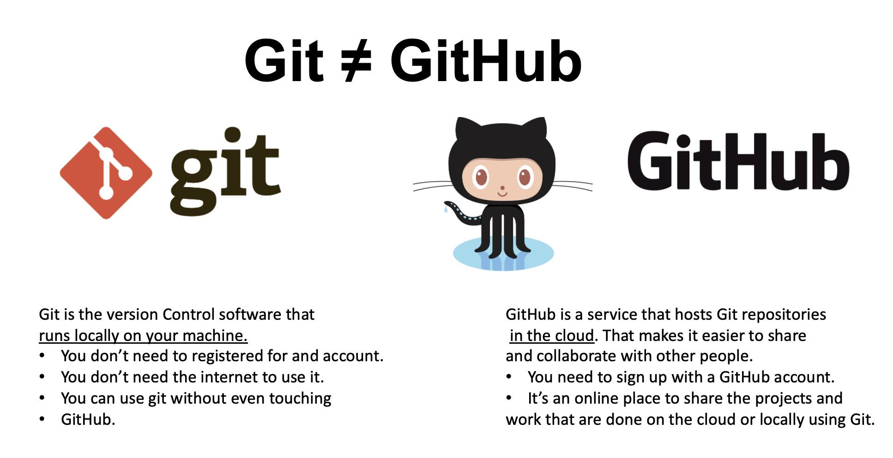
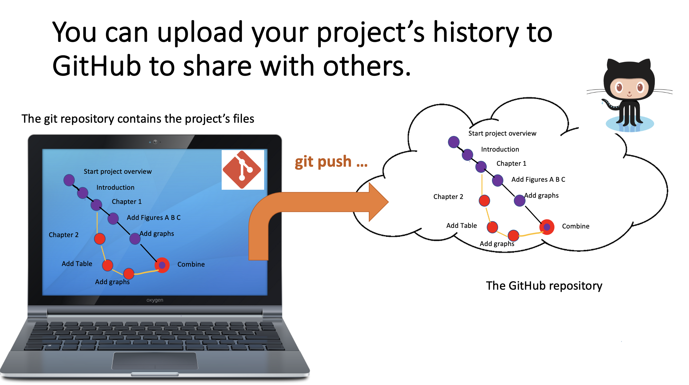
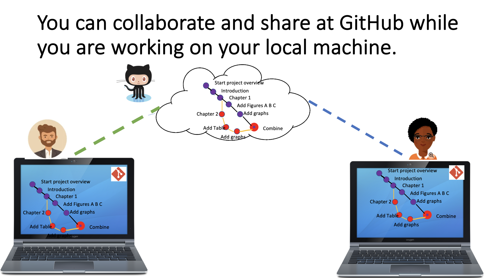

# Git and GitHub

Git is the most widely used version control software (VCS). It is a very powerfull tool to know, however it is quite difficult to start using it.
Git and GitHub are two different tools to facilitate version control, collabotation and sharing. It's important to understand that Git is not GitHub

Git is a software that opperates locally at your machine. 
A repository in Git is a project in a "Folder". It contains all of the files and folders associated with your project and all the various versions of them over time.That helps to manage project lines. If you are just using Git for version controll of the repository and you don't want to share your projects, you might never use GitHub.

GitHub is a service that hosts Git repositories in the cloud. Users could share a repository, and collaborate at various steps of the project.

A repository contains all of the files and folders associated with your project. It also includes the revision history of each file. The file history is a series of snapshots in time, known as commits. A commit tells Git that you made some changes that you want to record.

When you make a commit in Git you will see “commit to main.” This refers to the default branch, which can be thought of as the production-ready version of your project.
If you want to share your repositopy you connect to a GitHub account. You need to create a GitHub account for that purpose. In the GitHub the repository could be acessible by multiple users.

Your collaborators can download the GitHub repository to their local computer and work on a part of a project making a branch. Then they upload their work and after revisions could merge it to the main. 

Working with Git and GitHub teams effectively collaborate without missing any file or work done. The project repository is instantly assesible in the cloud and there are no wories about data losses.

